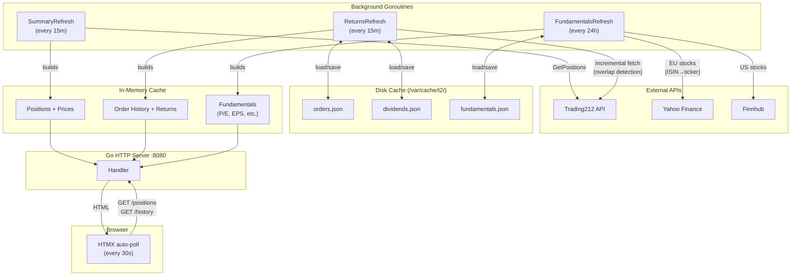
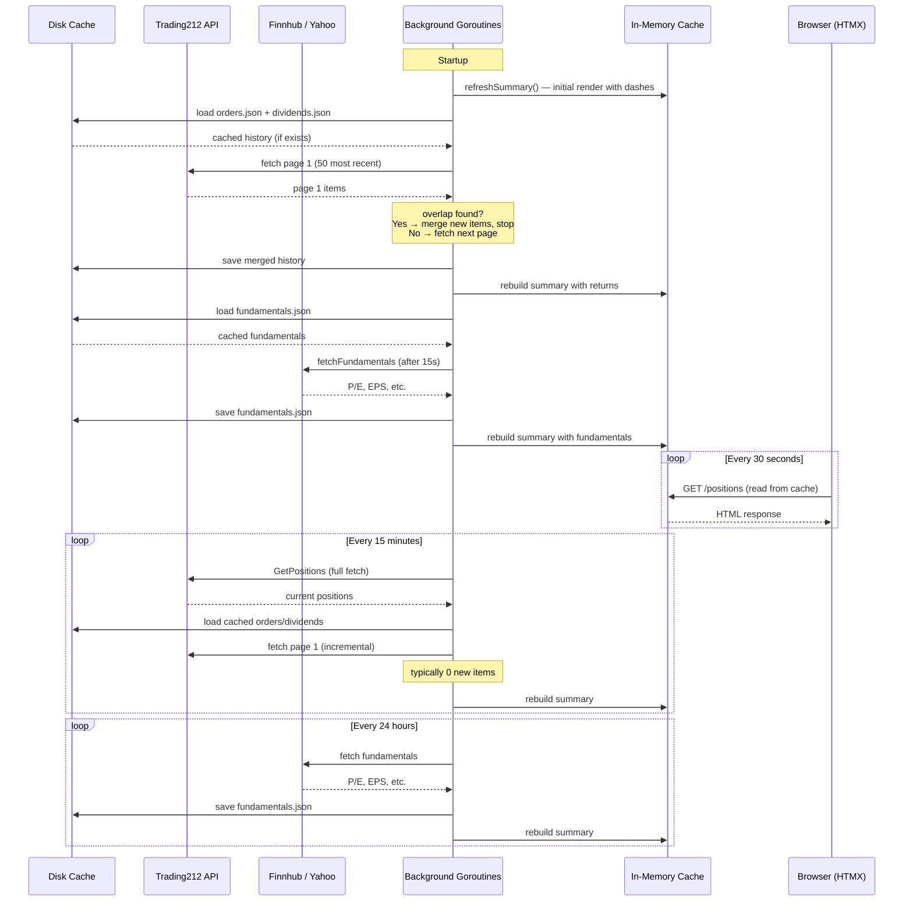

# t2

A web dashboard for viewing your Trading212 portfolio positions at a glance.

## Features

- Dark compact table with ticker, stock name, ISIN, market value (GBP), exchange, and more
- Accurate GBP market values using Trading212's own currency conversion
- Recovery tracking: recovered amount (sells + dividends), dividend yield %, performance %
- Financial fundamentals: P/E, EPS, EPS Growth, Market Cap, Revenue, Profit Margin
  - Fetched from Yahoo Finance (EU stocks, ISIN-based ticker lookup) with optional Finnhub for US stocks
  - Daily refresh with disk cache
  - Hover tooltips on column headers explaining each metric
  - ETFs detected via Trading212 instrument type → show "N/A" instead of dashes
  - P/E fallback: calculated from price/EPS when API doesn't return P/E directly
- Native currency prices with GBP conversion for foreign stocks
- Profitable position highlighting (green blink + favicon alert)
- Near-breakeven blinking (0–4% performance in orange)
- Buy history tooltips: hover over stock name to see purchase dates and quantities
- Historical FX rate conversion for foreign-currency orders
- Incremental history caching: orders and dividends cached to disk
  - Local: `~/.cache/t2/` — systemd fallback: `/var/cache/t2/` (owner-only permissions)
  - Cold start: fetches all pages from API, saves to disk
  - Warm start: fetches only new data by finding overlap with cache (typically 1 API call)
- Sortable columns (click headers to toggle ascending/descending)
- Default sort by market value descending
- Auto-refresh every 15 minutes + manual refresh button per row
- Exchange abbreviations with hover tooltips (LSE, NASDAQ, NYSE, XETR, EPA, etc.)
- Click-to-pin row highlighting that persists across auto-refreshes
- Double-click to select individual text spans (ticker, name, ISIN, raw ticker)
- Zebra striping and hover highlighting for row readability
- History tab for closed/sold positions with performance tracking and totals
- Exchange resolution via Trading212 metadata API
- Single binary with embedded HTMX (no CDN dependency)

## Quick Start

1. Copy and edit the config file:
   ```bash
   cp config.example.yaml config.yaml
   # Edit config.yaml with your Trading212 API credentials
   ```

2. Build and run:
   ```bash
   go build -o t2 ./cmd/t2
   ./t2
   ```

3. Open http://localhost:8080

## Installation (Debian/DietPi)

### Add the apt repository

```bash
# Import GPG key
curl -fsSL https://ko5tas.github.io/t2/t2-repo.gpg | sudo gpg --dearmor -o /usr/share/keyrings/t2-repo.gpg

# Add repository
echo "deb [signed-by=/usr/share/keyrings/t2-repo.gpg] https://ko5tas.github.io/t2 stable main" | sudo tee /etc/apt/sources.list.d/t2.list

# Install
sudo apt update && sudo apt install t2
```

### Configure

Edit `/etc/t2/config.yaml` with your Trading212 API credentials, then restart:

```bash
sudo systemctl restart t2
```

### Upgrade

```bash
sudo apt update && sudo apt upgrade
```

The service restarts automatically after upgrade.

### Service management

```bash
sudo systemctl status t2    # Check status
sudo systemctl restart t2   # Restart
sudo systemctl stop t2      # Stop
sudo journalctl -u t2 -f    # View logs
```

## Configuration

The config file is searched in order:
1. `$T2_CONFIG` environment variable
2. `~/.config/t2/config.yaml`
3. `/etc/t2/config.yaml`

| Setting | Default | Description |
|---------|---------|-------------|
| `api_key` | (required) | Trading212 API key |
| `api_secret` | (required) | Trading212 API secret |
| `base_url` | `https://live.trading212.com/api/v0` | API base URL |
| `refresh_interval` | `15m` | How often to refresh positions |
| `listen` | `:8080` | HTTP server listen address |
| `finnhub_api_key` | (optional) | [Finnhub](https://finnhub.io) API key for US stock fundamentals (free tier) |

## Architecture

### Data Flow



### Refresh Timeline



## License

See [LICENSE](LICENSE).
